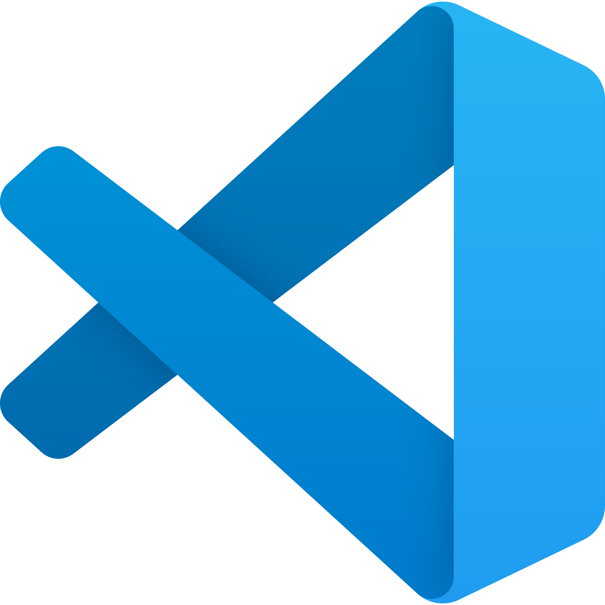
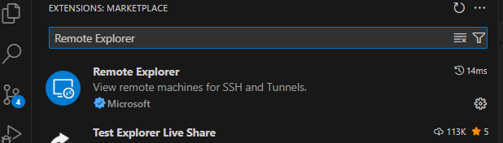
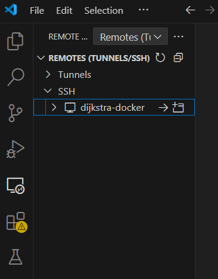
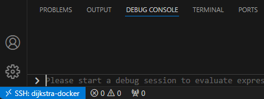
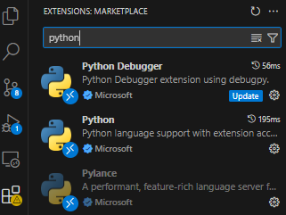

# Vislab Server Access

<p align="center">

</p>

These instructions will help you start working with Vislab's GPU servers. 

##  Accessing the Server
<details>

### 1. Find your server
The first step is to find the best server for you. 

Find Ryo, give him a brief description of your project and computing and data requirements. Also ask him to join Discord . Ryo and the server managers will then find the best server for you based on requirements and availability.

### 2. Server Login 
You will then receive the login credentials: username, password, port andIPv6 of the server. The server manager will also tell you the ID of the GPUs that are available to you, which you should use when creating reservations in the calendar.

The standard method for connecting to the machines is via SSH. If you’re outside the IST network, you’ll need to connect to [IST’s VPN]([https://duckduckgo.com](https://si.tecnico.ulisboa.pt/en/servicos/redes-e-conetividade/vpn/)).

If you don't have an ssh config file yet, create one:

```
cd ~/.ssh
nano config
```

And paste the server details in the file:
```
Host <server_name>
  Hostname <IPv6>
  Port <Port number>
  User <Username>
```
Then save and exit.

Now you can try to connect:
```
ssh <server_name>
```

### 3. SSH Key :key:
Add an openSSH key to avoid typing the password everytime. When prompted choose a passphrase (or not). In your terminal, type:
```
ssh-keygen
cd ~/.ssh/
cat id_rsa.pub
```

Copy the public key. Access the server and paste the public key in the authorized keys file (if the file doesn’t exist create it):
```
ssh <server_name>
mkdir .ssh
nano .ssh/authorized_keys
```
Paste the public key and save.
Exit the server and try to login again to confirm that the password is not requested.
 

</details>

## :calendar: Booking a slot in the calendar
<details>
- Make sure to make a reservation on the Calendar. Try not to book resources for more than 2 days. In exceptional cases like deadlines approaching you can contact the server manager and ask whether it is posisble to make a longer reservation at that time.
- Where to store data so that it can persist. Try to store datasets in the HDD.
</details>

##  VS Code Workflow 

<details>

### 1. Access the server using VS Code

To access the server from VS Code start by installing the Remote Explorer and Remote SSH extensions:
<p align="center">

</p> 

Reload VSCode: `Ctrl+Shift+P` then type Reload Window.

In the Remote Explorer Tab Select Tunnels/SSH, then refresh. If you followed the steps in Accessing the Server you should see your server listed.
<p align="center">

</p> 

Confirm you’re working in your server by looking at the blue label in bottom left corner:
<p align="center">

</p> 

Now you can go to to `File > Open Folder` and start navigating the server filesystem and editing files using VS Code.

### 2. Python Debugging with VS Code

You can use the Python Debugger while editing code in the server in VS Code.

1. Start by installing the Python and Python Debugger extensions.
<p align="center">

</p> 

2. Then, open the root directory of your current project and create a .vscode folder with a `launch.json` file in it.

   The launch.json is the config file for your debugging session. You can choose the entry file, set arguments and environment variables.

   Different use cases may require different launch.json files, so you may need to research the correct setup for you.

   Example launch.json file:

```json
{
    "version": "0.2.0",
    "configurations": [
        {
            "name": "Python Debugger: Current File with Arguments",
            "type": "debugpy",
            "request": "launch",
            "justMyCode": false,
            "program": "/home/mserra/dev/intrinsic/url_benchmark/pretrain.py",
            "cwd": "/home/mserra/dev/mujoco/sac_ae",
            "console": "integratedTerminal",
            "args": ["agent=drqv2ef", "task=metaworld_hammer-v2", "use_wandb=false", "wandb.run_name='efLatent'", "use_tb=false"],
            "env": {
                "CUDA_VISIBLE_DEVICES": "2",
                "MUJOCO_GL": "egl"
            }
        }
    ]   
}
```
3. You can now set a breakpoint and start debugging by clicking `Run > Start Debugging` or simply `F5`.

</details>
  
##  Jupyter Notebook Workflow

<details>
To write
</details>
